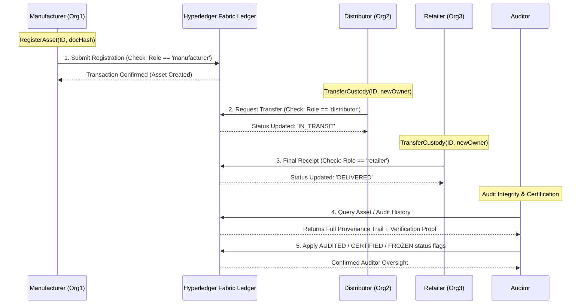

# Blockchain-Based Supply Chain Provenance System

## Overview
This project implements a supply chain provenance system using an Express.js API, a React frontend, IPFS storage, and a mock Hyperledger Fabric ledger. The system is designed to demonstrate asset registration, ownership transfer, status tracking, verification, and certification in a decentralized supply chain workflow.

## Technologies
- Node.js / Express.js
- React
- Mock Hyperledger Fabric logic in `services/fabricService.js`
- IPFS via embedded Helia node
- In-memory token sessions and mock ledger state

## Key Features
- Register assets with off-chain document references stored in IPFS
- Transfer ownership with current-owner verification
- Update supply chain statuses for each asset
- Verify asset authenticity with quality checks and audit history
- Auditor integrity validation with ledger proof, discrepancy detection, and conflict flags
- Issue certifications for regulatory or quality compliance
- Trace full product journey via historical events
- Enforce role-based access control for stakeholders

## User Roles
- **superuser**: full access
- **manufacturer**: register assets, transfer ownership, update status, query
- **distributor**: transfer ownership, update status, verify, query
- **retailer**: transfer ownership, verify, query
- **auditor**: verify, certify, query, trace history, audit integrity

## Supply Chain Flow



## Setup
```bash
npm install
npm start
```

Server runs on `http://localhost:3000` by default.

## Test Accounts
| Username | Password | Role |
|---|---|---|
| superuser | abcd1234 | superuser |
| ssinha94 | abcd1234 | manufacturer |
| josh | abcd1234 | distributor |
| zensparx | abcd1234 | retailer |
| nicolette | abcd1234 | auditor |

## API Endpoints
All endpoints except `/login` and `/health` require the header:
```
Authorization: Bearer <token>
```

### Authentication
- `POST /login` — authenticate and receive a session token
- `POST /logout` — invalidate current session token
- `GET /profile` — retrieve current user profile

### Asset Operations
- `POST /register` — register a new asset
- `GET /asset/:id` — query asset details
- `PUT /transfer` — transfer asset ownership
- `GET /trace/:id` — retrieve asset history

### Status Updates
- `PUT /status/:id` — update asset journey status
  - Valid statuses: `ORIGINATED`, `SHIPPED`, `RECEIVED`, `DELIVERED`, `VERIFIED`, `DAMAGED`, `LOST`, `AUDITED`, `CERTIFIED`, `FROZEN`
  - Auditor-only flags: `AUDITED`, `CERTIFIED`, `FROZEN`

### Verification
- `POST /verify/:id` — verify asset authenticity and quality
- `GET /verify/:id` — read verification history
- `GET /api/audit/:id` — perform auditor integrity validation, retrieve history audit proof, and detect conflicts or discrepancies

### Certification
- `POST /certifications/:id` — issue asset certification
- `GET /certifications/:id` — read certifications

### IPFS Storage
- `POST /ipfs/upload` — upload JSON metadata to IPFS
- `GET /ipfs/:cid` — retrieve IPFS metadata from IPFS

### System
- `GET /health` — health check endpoint

## Example Requests
### Register Asset
```json
{
  "assetId": "ASSET001",
  "docHash": "bafy..."
}
```

### Transfer Asset
```json
{
  "assetId": "ASSET001",
  "newOwner": "josh"
}
```

### Update Status
```json
{
  "status": "SHIPPED",
  "details": "Shipped via courier at 5°C"
}
```

### Verify Asset
```json
{
  "verificationNotes": "Document authenticity confirmed",
  "qualityCheck": true
}
```

### Issue Certification
```json
{
  "certificationType": "ISO_CERTIFICATION",
  "expiryDate": "2027-05-03",
  "metadata": {
    "standard": "ISO-9001"
  }
}
```

### Verify Integrity (Auditor)
```text
GET /api/audit/ASSET001
Authorization: Bearer <token>
```

## Running the UI
The React app is contained in `src/` and interacts with the Express backend via the same server. Use `npm start` to begin the client and API together.

## Project Structure
- `server.js` — Express API server
- `services/fabricService.js` — mock ledger and business logic
- `services/ipfsService.js` — IPFS helper functions
- `services/auth.js` — user authentication and role checks
- `src/` — React client components
- `chaincode/` — Fabric contract-style chaincode files

## Testing Implementation
```bash
npm test
```

## Notes
- The ledger is currently in-memory for demonstration and grading.
- IPFS uses an embedded Helia node and stores real CIDs.
- Role-based access control is enforced at the API layer.
