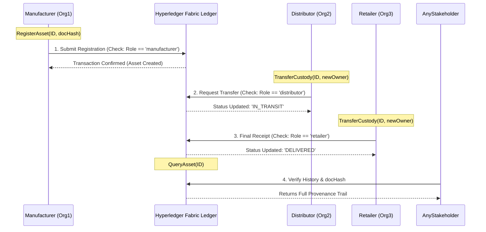

# Blockchain-Based Supply Chain Provenance System

## 📝 Project Description
This project addresses fragmented data and manual documentation in modern supply chains. Developed for **CSE 540** at ASU, we use **Hyperledger Fabric** to create a secure, unified record for tracking assets. 

The system records key events—product registration, shipment dispatch, and ownership transfer—on a tamper-resistant ledger. By linking off-chain documents (like Bills of Lading) to on-chain cryptographic hashes, we ensure data integrity and real-time accountability for all stakeholders.

## 🚀 Recent Updates (System Evolution)
- **Zero-Config Execution**: Removed dependency on live Docker/Fabric networks. The system now uses a volatile in-memory **Mock Ledger** backend seamlessly responding to all Fabric service calls, enabling instant testing by graders with zero setup!
- **Off-Chain IPFS Integration**: Implemented a fully embedded JS-based IPFS node (`Helia`). The `docHash` variable in registry records now natively holds actual **IPFS CIDs** generated by rich metadata pushes during registration!
- **Interactive Asset Transfers**: Added a dedicated `AssetTransfer` module directly onto the query dashboard. Users can securely transfer assets to new participants, guarded by server-side asserts verifying `req.user.username === asset.Owner`.
- **Dynamic Immutable Provenance Logging**: Integrated a smart system mapping stakeholder roles to transfer states natively (e.g. transfers to a Distributor yield `IN_STORAGE`, transfers to Retailers yield `DELIVERED`). The **Product Journey** trace viewer dynamically renders this exact on-chain history exactly as-is!

## 👥 Team Members
1. **Adedoyin Keshinro**
2. **Joshua Sabels**
3. **Nicolette Williams**
4. **Santoso Ham**
5. **Sumit Sinha**

---

## 🏗️ System Design & Architecture
The architecture is built on a permissioned network using the Fabric Contract API.

### 1. Smart Contract Interfaces (Task 1)
Our chaincode defines core interfaces to manage the asset lifecycle:
* `RegisterAsset`: Initializes a shipment with a unique ID and a SHA-256 document hash.
* `TransferCustody`: Updates the owner and status as the asset moves through the chain.
* `QueryAsset`: Retrieves the current state and provenance history of a specific item.
* `createContext`: A custom interface (**SupplyChainContext**) that acts as the "environment" for every transaction. It extracts participant roles (Manufacturer, Distributor, etc.) from X.509 certificates to enforce security.

### 2. Role-Based Access Control (RBAC)
We implement RBAC to ensure only authorized nodes can modify the ledger:
* **Manufacturers**: Authorized to call `RegisterAsset`.
* **Distributors/Retailers**: Authorized to call `TransferCustody`.
* **Auditors**: Granted read-only access to verify document hashes.

---

## 🌐 API Layer (Express.js Server)

The API layer provides RESTful endpoints that allow web applications and external systems to interact with the blockchain network.

### Setup & Usage
```bash
# Install dependencies
npm install

# Start the API server
npm start

# Development mode with auto-restart
npm run dev
```

### Configuration
1. **Environment Variables**: Set `PORT` for server port (default: 3000)
2. **Blockchain Connection**: The system currently runs on an integrated in-memory mock ledger for seamless testing. No Fabric network configuration or user certificates are currently required!

### API Endpoints

#### POST /register
Register a new asset in the supply chain.

**Request Body:**
```json
{
  "assetId": "string",
  "docHash": "string"
}
```
*(Note: Initial owner identity is securely evaluated directly from your logged-in JWT session token instead of being manually submitted)*

**Response:**
```json
{
  "success": true,
  "message": "Asset ASSET_ID registered successfully"
}
```

#### PUT /transfer
Transfer custody of an asset to a new owner.

**Request Body:**
```json
{
  "assetId": "string",
  "newOwner": "string"
}
```

**Response:**
```json
{
  "success": true,
  "message": "Asset ASSET_ID transferred to NEW_OWNER by USER"
}
```

#### GET /asset/:id
Query details of a specific asset.

**Response:**
```json
{
  "success": true,
  "asset": {
    "ID": "string",
    "Owner": "string",
    "DocumentHash": "string",
    "Status": "string",
    "Timestamp": {}
  }
}
```

#### GET /trace/:id
Get the complete trace/history of an asset.

**Response:**
```json
{
  "success": true,
  "history": [
    {
      "ID": "string",
      "Owner": "string",
      "DocumentHash": "string",
      "Status": "string",
      "Timestamp": {}
    }
  ]
}
```

#### GET /health
Health check endpoint.

**Response:**
```json
{
  "status": "OK",
  "timestamp": "ISO_DATE_STRING",
  "service": "Supply Chain API"
}
```

### Error Responses
All endpoints return errors in the following format:
```json
{
  "error": "Error message",
  "details": "Detailed error information"
}
```

**Common HTTP status codes:**
- `200` - Success
- `201` - Created
- `400` - Bad Request (missing required fields)
- `404` - Not Found (asset doesn't exist)
- `500` - Internal Server Error

### Frontend Integration
The API server includes CORS headers to allow cross-origin requests from web applications.

**Example frontend integration:**
```javascript
// Register an asset
fetch('http://localhost:3000/register', {
  method: 'POST',
  headers: { 'Content-Type': 'application/json' },
  body: JSON.stringify({
    assetId: 'ASSET001',
    owner: 'ManufacturerA',
    docHash: 'sha256_hash_of_document'
  })
});

// Query an asset
fetch('http://localhost:3000/asset/ASSET001')
  .then(res => res.json())
  .then(data => console.log(data));
```

## ⚛️ React Client (UI)

A modern React-based user interface integrated into the Express server.

### Features
- **Asset Registration**: Register new assets with document hashes
- **Asset Query**: Search and view asset details
- **Product Journey Visualization**: Track assets through Creation → Shipment → Storage → Delivery
- **Real-time Updates**: Live connection to the Express API

### Running the Application
```bash
# Install all dependencies
npm install

# Build the React client
npm run build

# Start the server (serves both API and React UI)
npm start
```

### Accessing the UI
- **API Endpoints**: `http://localhost:3000/api/*`
- **React UI**: `http://localhost:3000/app`

The React application is served at the `/app` endpoint by the same Express server that handles the API.

---

### Local Development & Unit Testing
Before deploying to the blockchain, validate the contract logic and interfaces:
```bash
npm install
npm test
```

### Linting
This project uses ESLint with strict checks (including `max-len: 120`) to enforce style and best practices.

Run:
```bash
npm run lint
```

Auto-fix formatting issues where possible:
```bash
npm run lint:fix
```

If lint introduces failures, inspect changed files and update to meet ESLint rules.

---

## 🔄 System Flow & Trust Visualization

The following diagram illustrates the interaction between supply chain participants and the smart contract, highlighting how Role-Based Access Control (RBAC) ensures only authorized parties can modify the asset state.



---

*This repository serves as the official record of development for CSE 540.*
