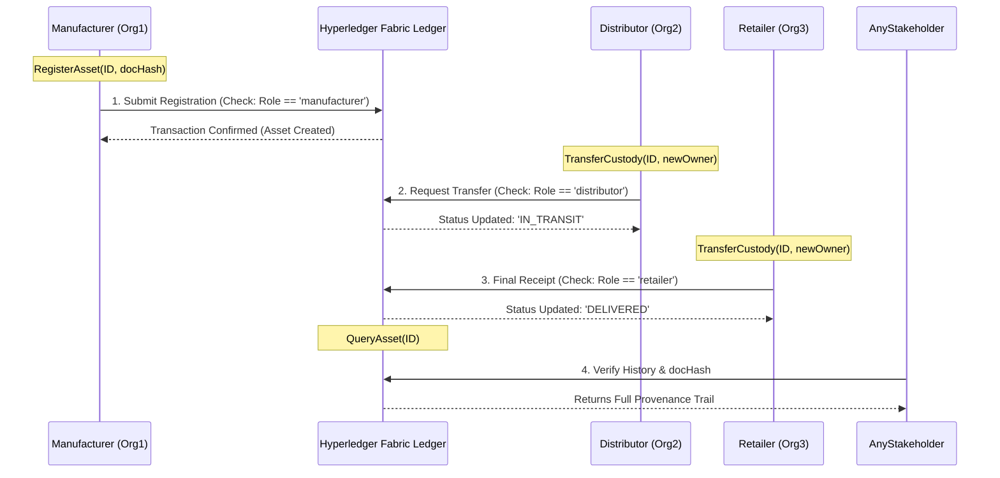

# Blockchain-Based Supply Chain Provenance System

## 📝 Project Description
This project addresses fragmented data and manual documentation in modern supply chains. Developed for **CSE 540** at ASU, we use **Hyperledger Fabric** to create a secure, unified record for tracking assets. 

The system records key events—product registration, shipment dispatch, and ownership transfer—on a tamper-resistant ledger. By linking off-chain documents (like Bills of Lading) to on-chain cryptographic hashes, we ensure data integrity and real-time accountability for all stakeholders.

## 👥 Team Members
1. **Adedoyin Keshinro**
2. **Joshua Sabels**
3. **Nicolette Williams**
4. **Santoso Ham**
5. **Sumit Sinha**

---

## 🏗️ System Design & Architecture
The architecture is built on a permissioned network using the Fabric Contract API.

### 1. Smart Contract Interfaces (Task 1)
Our chaincode defines core interfaces to manage the asset lifecycle:
* `RegisterAsset`: Initializes a shipment with a unique ID and a SHA-256 document hash.
* `TransferCustody`: Updates the owner and status as the asset moves through the chain.
* `QueryAsset`: Retrieves the current state and provenance history of a specific item.
* `createContext`: A custom interface (**SupplyChainContext**) that acts as the "environment" for every transaction. It extracts participant roles (Manufacturer, Distributor, etc.) from X.509 certificates to enforce security.

### 2. Role-Based Access Control (RBAC)
We implement RBAC to ensure only authorized nodes can modify the ledger:
* **Manufacturers**: Authorized to call `RegisterAsset`.
* **Distributors/Retailers**: Authorized to call `TransferCustody`.
* **Auditors**: Granted read-only access to verify document hashes.

---

## 🚀 Execution & Usage

### Local Development & Unit Testing
Before deploying to the blockchain, validate the contract logic and interfaces:
```bash
npm install
npm test
```

### Linting
This project uses ESLint with strict checks (including `max-len: 120`) to enforce style and best practices.

Run:
```bash
npm run lint
```

Auto-fix formatting issues where possible:
```bash
npm run lint:fix
```

If lint introduces failures, inspect changed files and update to meet ESLint rules.

---

## 🔄 System Flow & Trust Visualization

The following diagram illustrates the interaction between supply chain participants and the smart contract, highlighting how Role-Based Access Control (RBAC) ensures only authorized parties can modify the asset state.



---

*This repository serves as the official record of development for CSE 540.*
